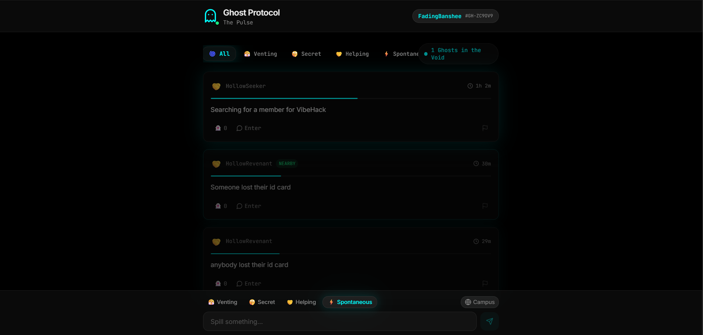

# 👻 Ghost Protocol: The Anonymous Void



> **"Whisper to the void. Watch it fade. No traces. No regrets."**

Ghost Protocol is a high-stakes, low-anxiety ephemeral social space designed for students. It’s where your thoughts live for a moment and vanish forever. Built with the **MERN Stack** and **Socket.io** for real-time spectral communication.

---

## ⚡ Why Ghost Protocol?

In a world of permanent digital footprints, **Ghost Protocol** offers a breath of fresh air. 
* **No Accounts:** No sign-up, no login, no tracking.
* **Random Identity:** Every time you enter, you get a new spectral alias (e.g., *HollowRevenant*).
* **Self-Destructing:** Every "Spill" (post) has a 2-hour lifespan. After that, it’s gone from the DB.
* **Zero History:** Chat threads exist only as long as ghosts are active. Once the last person leaves, the room is purged.

---

## 🚀 Spectral Features

### 1. 🌑 The Void (Global Feed)
Share your "Spills" with the world. Filter by mood (Chill, Rant, Secret, Spooky) to find fellow ghosts.

### 2. 💬 Whisper Threads (Real-time Chat)
Click any spill to enter an anonymous chat room. Powered by **Socket.io**, messages pop up instantly. 
* **Typing Indicators:** See when a ghost is "whispering..."
* **Chat History:** New ghosts can see previous messages in the thread (synced via MongoDB).

### 3. 🚨 The Kill Switch
The ultimate privacy tool. One click and you're out of the thread instantly.

### 4. 🕵️ Boss Key (Stealth Mode) - *[Esc] Key*
Stuck in a lecture? Roommate walked in? Hit **`Esc`** to instantly swap the UI for a fake **Google Scholar** page. Press again to return to the void.

### 5. 🟢 Void Stats
Live counter showing exactly how many ghosts are currently haunting the protocol.

---

## 🛠️ The Tech Stack

| Layer | Technology |
| :--- | :--- |
| **Frontend** | React + Vite + Tailwind CSS |
| **UI Library** | Radix UI + Lucide Icons + Framer Motion |
| **Backend** | Node.js + Express |
| **Database** | MongoDB Atlas (Cloud) |
| **Real-time** | Socket.io |
| **Deployment** | Vercel (Frontend) + Render (Backend) |

---

## 🏁 Quick Start

1. **Clone the Repo**
   ```bash
   git clone https://github.com/Rahul-kr1623/Ghost-Frontend.git
   ```
2. **Install Dependencies**

   ```bash
   npm install
   ```
3. **Set Environment Variables**

   Create a .env in the backend and add your MONGO_URI.

4. **Summon the Ghosts (Run)**

   ```bash
   # Frontend
   npm run dev

   # Backend
   node server.js
   ```
**🛡️ Privacy First**

   We use SessionStorage to keep your alias consistent during a session, but as soon as you close the tab, your identity is erased. No cookies, no trackers, just    vibes.

   Built with 💀 for VibeHack '26